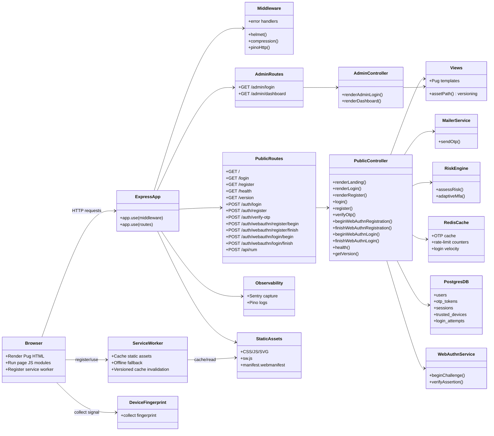

# Architecture (Frontend + Backend)

This document shows how the browser, SSR frontend, and Express backend work together.

## Class Diagram

## Sequence Diagram

## Notes

- `assetPath()` appends asset version data for cache-busting.
- `X-App-Version` response header exposes backend app version.
- Service worker supports offline fallback and cached static resources.
- Risk engine drives adaptive MFA (OTP/WebAuthn) based on device/IP/velocity signals.
- OTP values are stored hashed in Postgres and cached in Redis with TTL.
